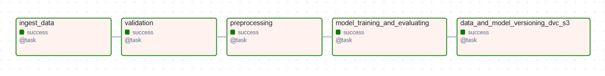
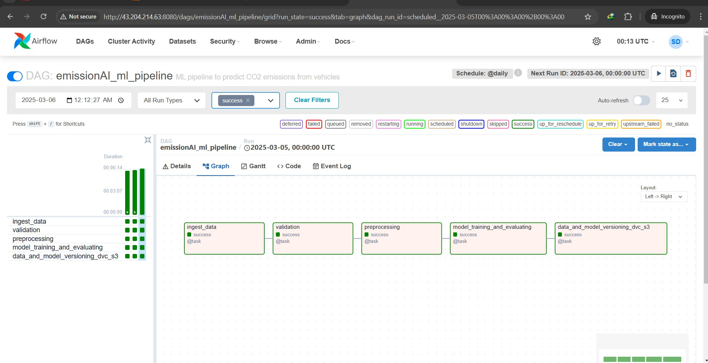
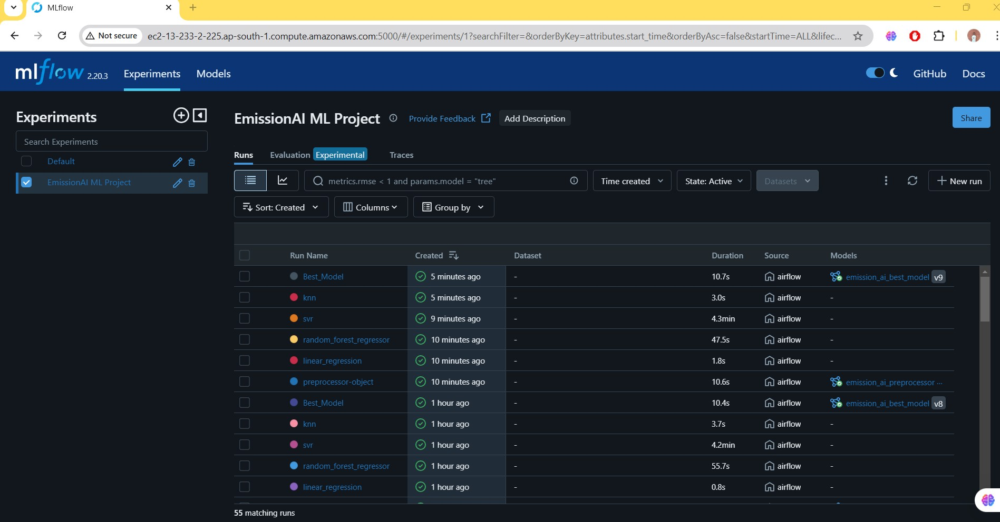
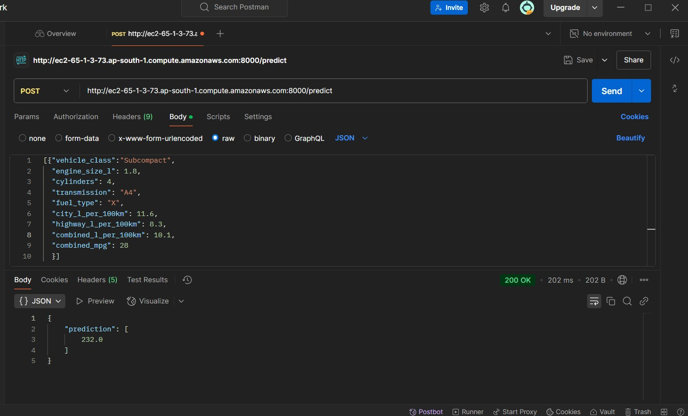

# EmissionAI - Machine Learning Pipeline with Airflow, DVC, MLflow and AWS

## 📊 Project Overview
This project implements an end-to-end machine learning pipeline that predicts CO₂ emissions from vehicle data. It leverages Apache Airflow for workflow automation, DVC for data and model versioning, MLflow for model tracking, Flask for API creating, and AWS for deployment.

## 🧰 Tech Stack

- **Languages & Libraries:** Python (pandas, numpy, scikit-learn, Flask, SQLAlchemy)
- **ML Operations:** MLflow (model tracking, artifact storage), DVC (data and model versioning)
- **Workflow Automation:** Apache Airflow (orchestration and scheduling)
- **Containerization:** Docker (custom images for Airflow and Flask)
- **Deployment & Cloud:** AWS (RDS PostgreSQL, S3, EC2, ECR)
- **CI/CD:** GitHub Actions

## 🚀 Key Features

### ✅ Data Ingestion
- Extracts data from **AWS RDS PostgreSQL** using **SQLAlchemy**.

### 📏 Data Validation
- Validates column names and data types against a defined schema.

### 🔍 Data Preprocessing
- Includes **data cleaning, scaling, encoding**, and **feature selection**.
- Utilizes **Pandas**, **scikit-learn Pipelines**, and **ColumnTransformer** and other scikit-learn modules for preprocessing.

### 📊 Model Training and Evaluation
- Trains multiple models from **scikit-learn** and evaluates performance on test data.
- Performs hyperparameter tuning using **GridSearchCV** and generates a comprehensive tuning report.

### 📂 Artifact Versioning
- Versions validated datasets, preprocessing pipelines, and trained models using **DVC (Data Version Control)**.
- Utilizes an **S3 bucket** as the remote storage backend for DVC.

### ⚙️ Automation with Airflow
- The full ML pipeline (from data ingestion to artifact versioning) is automated and scheduled using **Apache Airflow**.
- 

### 📊 Integrated MLflow
- Runs on an **EC2 instance** with **AWS RDS PostgreSQL** as the backend store for tracking metadata and **S3** for storing artifacts.
- Logs the entire machine learning lifecycle, including:
    - Preprocessor object
    - Model parameters
    - Evaluation metrics
    - Hyperparameter tuning reports
    - The best model
    - 

### 🔮 Prediction API
- Implements a **Flask API** for real-time predictions.
- Loads the latest preprocessor and model from the **MLflow Model Registry**.
- 

### 📦 Containerization and Deployment
- Utilizes **Docker** for containerizing Airflow and the Flask API.
- Automates **CI/CD** with **GitHub Actions** to:
    - Build and push Docker images to different **AWS ECR** repositories.
    - Pull and run images on separate **EC2** instances.
    - Dynamically generate environment variables from GitHub secrets.

